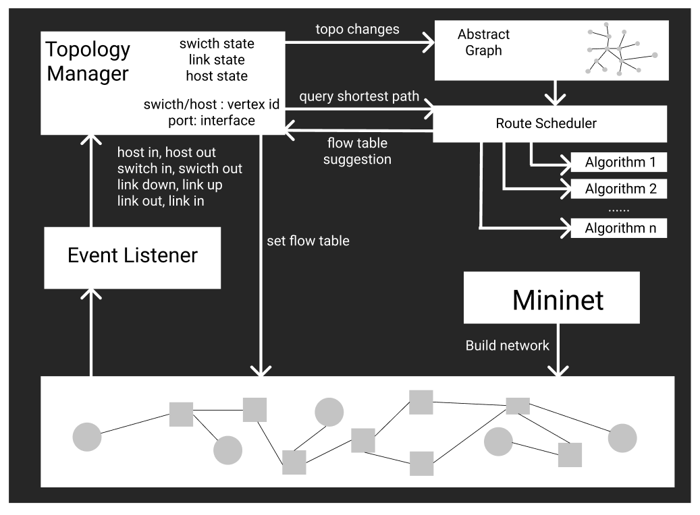

# Simple SDN
Homework assignment of CS305 in SUSTech. Using ryu and Mininet to implement a simple SDN

## Contributors

王炜皓 sid: 11710403 Architecture, Algorithm

欧阳晖 sid: 11710106 Controller, Event handler

蔡永宁 sid: 11710802 Testing, Code Review

##### Suggested grading proportion

1 : 1 : 1


## Background

Using ryu (https://github.com/osrg/ryu) and Mininet (https://github.com/mininet/mininet) to implement a software defined network (SDN). In this project, we implemented a simple controller to handle some simple network events in any connected network. 

We implemented both weighted algorithm (Dijkstra's algorithm) and unweighted algorithm (BFS) to handle different demands (e.g. Shortest path query based on a given weighting strategy, Minimum Hop Count).

We also made the controller generates a reply when an ARP requests is received from a host or switch. (In this project, ARP is directed sent to the controller instead of boardcasted to everyone).

To deal with boardcast storm generating by ping finding a no existed IP address, we implemented a spanning tree algorithm which is used to maintain the flow table in order to avoid boardcast storm.


## Code Structure

`DataStructure.py` 

Some important data structures: Stack, Queue, Heap supporting updating priority of elements and Priority Queue.

`Graph.py`

Definitions of an abstract graph for the real network. Including Vertex, Edge and Graph.

`test_graph.py`

Some test cases to test `Graph.py`. Also demonstrating how to use some functions in Graph.py

`RouteScheduler.py`

Schedule routes by a specified algorithm. Three pre-defined algorithms are provided. Including calculating Spanning Tree, computing minimum hop count by BFS and computing shortest path by Dijkstra's algorithm.


## Architecture

The architecture of this program is shown in the figure below. 



​                                                                        *Fig. 1 Architecture*

#### Basic Components in Controller

**Route Scheduler** : Maintains an abstract graph of the real network. Send `flow table suggestion` to topology manager when a query is received. The `flow table suggestion` is computed by a algorithm selected from some pre-defined algorithms by user.

Topology Manager : 

Event Listener : 


#### Workflow

First, Mininet emulates or creates a simulated network.

And then, a ryu application implemented by us will start and monitor the network emulated by Mininet.

An event handler in the controller will be invoked when an network event happens (e.g. topological changes of the network).

The event handler will forward the essential information to the topology manager to synchronize the network topology information stored in the controller.

The topology manager will also send information to route scheduler to synchronize the abstract graph of the real network.

When new forward path is needed, route scheduler will compute the new shortest path by using the algorithm specified by user.

After that, topology manager set a new forward path in the network by installing flow tables of switches.


## Controller


## Abstract graph and Algorithms

A vertex can be a switch or a host. An edge is a link connecting two devices.

The abstract graph is an weighted directed graph, which is general enough to handle the real network.

### API of Graph.py

```python
def changeInterfaceState(self, v1_id, v1_interface_id, state)
```
Change the state of a port specified by the id of its vertex and its interface id


```python
def addEdge(self, v1_id, v2_id, v1_interface, v2_interface)
```
Add an edge between two vertices by provided the ids of these two vertices and also the interface ids in these two vertices.


```python
def removeEdge(self, vid, interface_id)
```
Remove an edge by provided information of an arbitrary interface of this edge


```python
def addVertex(self, vid, interface_ids)
```
Add a new vertex to the graph by provided its id and all its interface ids.


```python
def removeVertex(self, vid)
```
Remove a vertex from graph by provided its vertex id.


```python
def queryShortestPath(self, vid, model='BFS', weight_dict=None)
```
Get new flow table suggestion by provided a specified model. (i.e. BFS or Dijkstra). If you want to use Dijkstra, you may provides a weight dictionary. Otherwise, the default weight of edges will be used, which is 1 all the time.


```python
def print_path(self, src_id, dst_id)
```
Get a string describing the whole path from source to destiantion


```python
def print_spanning_tree(self)
```
Get a string describing the toplogy of the spanning tree which is using.


```python
def print_topology(self)
```
Get a string describing the topology of the abstract graph.


### API of RouteScheduler.py
```python
def updateSpanningTree_BFS(self, root_vid)
```
Update spanning tree according to current topology information by provided id of the vertex which is the root of the spanning tree.


#### BFS

Breadth first search. Used to find minimum hop count routes


#### Dijkstra's Algorithm

Weighted shortest path query. Used to find routes with shortest cost.


#### Spanning Tree

Compute a spanning tree in time complexity of O(n). Used to avoid broadcast storm. 


## Testing

