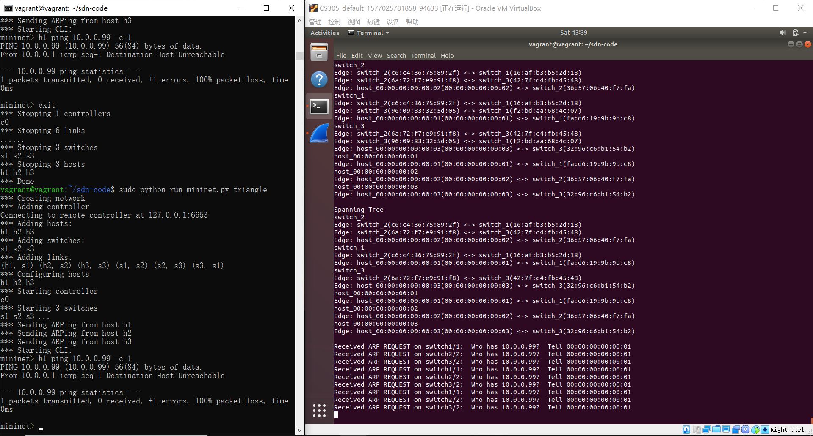

# Simple SDN
Homework assignment of CS305 in SUSTech. Using ryu and Mininet to implement a simple SDN

## Contributors

王炜皓 sid: 11710403 Architecture, Algorithm

欧阳晖 sid: 11710106 Controller, Event handler

蔡永宁 sid: 11710802 Testing, Code Review

##### Suggested grading proportion

1 : 1 : 1


## Background

Using ryu (https://github.com/osrg/ryu) and Mininet (https://github.com/mininet/mininet) to implement a software defined network (SDN). In this project, we implemented a simple controller to handle some simple network events in any connected network. 

We implemented both weighted algorithm (Dijkstra's algorithm) and unweighted algorithm (BFS) to handle different demands (e.g. Shortest path query based on a given weighting strategy, Minimum Hop Count).

We also made the controller generates a reply when an ARP requests is received from a host or switch. (In this project, ARP is directed sent to the controller instead of boardcasted to everyone).

To deal with boardcast storm generating by ping finding a no existed IP address, we implemented a spanning tree algorithm which is used to maintain the flow table in order to avoid boardcast storm.


## Code Structure

`DataStructure.py` 

Some important data structures: Stack, Queue, Heap supporting updating priority of elements and Priority Queue.

`Graph.py`

Definitions of an abstract graph for the real network. Including Vertex, Edge and Graph.

`test_graph.py`

Some test cases to test `Graph.py`. Also demonstrating how to use some functions in Graph.py

`RouteScheduler.py`

Schedule routes by a specified algorithm. Three pre-defined algorithms are provided. Including calculating Spanning Tree, computing minimum hop count by BFS and computing shortest path by Dijkstra's algorithm.

`run_mininet.py`

Runs mininet with different topologies. Provided by the course, not need to modify this.

`shortest_paths.py`

The main file to implement the SDN, it's a bridge between topo manager and the network, with the function of Event Listener in the graph below. Also it finish the flow table setting movement. The course provided a simple version.

`topo_manager.py`

Implement the Topology Manager, which use to store the status of the network and abstract these information to abstract Graph and query the flow table suggestion from Route Scheduler. This file finished based on the topo manager example which provided by course.

`ofctl_utils.py`

Some useful utils implement by ryu provided by the course.

`config.py`

The configuration file help the user to configure some attribute easily.

## Architecture

The architecture of this program is shown in the figure below. 


​                                                                        *Fig. 1 Architecture*

#### Basic Components in Controller

**Route Scheduler** : Maintains an abstract graph of the real network. Send `flow table suggestion` to topology manager when a query is received. The `flow table suggestion` is computed by a algorithm selected from some pre-defined algorithms by user.

**Topology Manager :** Stored the needed information (including the concrete state of switch, link, host, some mapping information and so on).  Abstract the topology, send the topo change to abstract graph, and query the needed algorithm from Route Scheduler.

**Event Listener :**  Listen the Event from the network, and send the changes to the Topology Manager. Also finish the last step of setting flow table.

#### Workflow

First, Mininet emulates or creates a simulated network.

And then, a ryu application implemented by us will start and monitor the network emulated by Mininet.

An event handler in the controller will be invoked when an network event happens (e.g. topological changes of the network).

The event handler will forward the essential information to the topology manager to synchronize the network topology information stored in the controller.

The topology manager will also send information to route scheduler to synchronize the abstract graph of the real network.

When new forward path is needed, route scheduler will compute the new shortest path by using the algorithm specified by user.

After that, topology manager set a new forward path in the network by installing flow tables of switches.


## Controller

### The mode configuration explanation

**loop_mode**

Set the mode whether the non-mapping ARP message will cause a loop storm.

False: all the ARP message which cannot mapping a specific MAC address will packet in but no actions, that means the ARP message will not cause loop storm.

True: the ARP message which cannot mapping a specific MAC address will packet in and will be sent back by OFPP_FLOOD, that means it maybe cause loop storm.

**sp_mode**

Set if use the spanning tree algorithm.

For spanning tree algorithm will cause the shortest path not the true shortest path, the sp_mode will be False when the loop_mode is False even though the sp_mode set to be True.

False: will not use the spanning tree algorithm.

True: using the spanning tree algorithm to avoid non mapping ARP message causing loop storm.

### The abstraction flow

The brief step:

```
Network -> Event -> Changes -> shorest_path.py -> topo_manager.py -> exchange the changes and store the infomation -> Abstract Graph & Route Scheduler
```

Some examples (just show the method work flow, some working details, including the event exchanges, status storing and so on, will not be shown here):

The method work flow when a switch enter.

```python
@set_ev_cls(event.EventSwitchEnter) -> def handle_switch_add(self, ev) ->  def add_switch(self, sw) -> def addVertex(self, vid, interface_ids)
```

The method work flow when a host enter.

```python
@set_ev_cls(event.EventHostAdd) -> def handle_host_add(self, ev) ->  def add_host(self, h) ->  def addVertex(self, vid, interface_ids) & addEdge(self, v1_id, v2_id, v1_interface, v2_interface)
```

The method work flow when a switch removed.

```python
@set_ev_cls(event.EventSwitchLeave) -> def handle_switch_delete(self, ev) ->  def delete_switch(self, sw) -> def removeVertex(self, vid)
```

The method work flow when a link added.

```python
@set_ev_cls(event.EventLinkAdd) -> def handle_link_add(self, ev) ->  def add_link(self, name1, mac1, name2, mac2) -> def addEdge(self, v1_id, v2_id, v1_interface, v2_interface)
```

The method work flow when a link removed.

```python
@set_ev_cls(event.EventLinkDelete) -> def handle_link_delete(self, ev) -> def delete_link(self, name1, mac1, name2, mac2) -> def removeEdge(self, vid, interface_id)
```

The method work flow when a port status changed.

```python
@set_ev_cls(event.EventPortModify) -> def handle_port_modify(self, ev) ->  def change_interface_state(self, name, mac, state) -> def changeInterfaceState(self, v1_id, v1_interface_id, state)
```

### Flow table setting flow

The brief step:

```
Exchaneges happens -> Finished changing status -> shorest_path.py -> topo_manager.py -> query the flow suggestion -> Abstract Graph & Route Scheduler -> topo_manager.py -> exhange the suggestion -> shorest_path.py -> setting the flow table
```

How to set the flow table:

For a data path, just get a following object and send this object to the data path by the send_msg method.

```python
ofproto_parser.OFPFlowMod(datapath, cookie, cookie_mask, table_id,
						  command, idle_timeout, hard_timeout,
						  priority, buffer_id,
						  out_port, out_group,
						  flags, match, instructions)
```

Here, just configure the attribute match, instruction, other attributes will be set default values.

match: the match rule for the packages

instruction: if the packages match the match rule, what actions should be down

## Abstract graph and Algorithms

A vertex can be a switch or a host. An edge is a link connecting two devices.

The abstract graph is an weighted directed graph, which is general enough to handle the real network.

### API of Graph.py

```python
def changeInterfaceState(self, v1_id, v1_interface_id, state)
```
Change the state of a port specified by the id of its vertex and its interface id


```python
def addEdge(self, v1_id, v2_id, v1_interface, v2_interface)
```
Add an edge between two vertices by provided the ids of these two vertices and also the interface ids in these two vertices.


```python
def removeEdge(self, vid, interface_id)
```
Remove an edge by provided information of an arbitrary interface of this edge


```python
def addVertex(self, vid, interface_ids)
```
Add a new vertex to the graph by provided its id and all its interface ids.


```python
def removeVertex(self, vid)
```
Remove a vertex from graph by provided its vertex id.


```python
def queryShortestPath(self, vid, model='BFS', weight_dict=None)
```
Get new flow table suggestion by provided a specified model. (i.e. BFS or Dijkstra). If you want to use Dijkstra, you may provides a weight dictionary. Otherwise, the default weight of edges will be used, which is 1 all the time.


```python
def print_path(self, src_id, dst_id)
```
Get a string describing the whole path from source to destiantion


```python
def print_spanning_tree(self)
```
Get a string describing the toplogy of the spanning tree which is using.


```python
def print_topology(self)
```
Get a string describing the topology of the abstract graph.


### API of RouteScheduler.py
```python
def updateSpanningTree_BFS(self, root_vid)
```
Update spanning tree according to current topology information by provided id of the vertex which is the root of the spanning tree.


#### BFS

Breadth first search. Used to find minimum hop count routes


#### Dijkstra's Algorithm

Weighted shortest path query. Used to find routes with shortest cost.


#### Spanning Tree

Compute a spanning tree in time complexity of O(n). Used to avoid broadcast storm. 


## Testing

### Before test

```bash
vagrant@vagrant:~$ cd sdn-code
vagrant@vagrant:~/sdn-code$ ryu-manager --observe-links shortest_paths.py
```

### Test case 1: single 5

```bash
vagrant@vagrant:~/sdn-code$ sudo python run_mininet.py single 5
```

```
mininet> net
mininet> pingall
mininet> link s1 h1 down //测试switch和host
mininet> pingall
mininet> link s1 h1 up
mininet> pingall
```


### Test case 2: linear 5

```shell
vagrant@vagrant:~/sdn-code$ sudo python run_mininet.py linear 3
```

```
mininet> net
mininet> pingall
mininet> link s2 s3 down //测试switch和swtich
mininet> pingall
mininet> link s2 s3 up
```


### Test case 3: tree 2

```
vagrant@vagrant:~/sdn-code$ sudo python run_mininet.py tree 2
```

```
mininet> net
mininet> pingall
mininet> link s1 s3 down
mininet> h1 ping h2 -c 1
```


### Test case 4: assign1

```
vagrant@vagrant:~/sdn-code$ sudo python run_mininet.py assign1
```

```
mininet> net
mininet> pingall
mininet> link s2 s3 down
mininet> link s5 s3 up //src and dst not connected: s5 s3
mininet> pingall
```


### Test case 5: triangle

```
vagrant@vagrant:~/sdn-code$ sudo python run_mininet.py triangle
```

```
mininet> net
mininet> pingall
mininet> link s1 s3 down
mininet> h1 ping h3 -c 1
mininet> link s2 s3 down
mininet> h1 ping h3 -c 1
mininet> link s1 s3 up
mininet> h1 ping h3 -c 1
```


### Test case 6: mesh 5

```
vagrant@vagrant:~/sdn-code$ sudo python run_mininet.py mesh 5
```

```
mininet> net
mininet> pingall
mininet> link s1 s2 down
mininet> link s1 s4 down
mininet> link s1 s5 down
mininet> link s2 s4 down
mininet> link s2 s5 down
mininet> link s3 s4 down
mininet> pingall 
```


### Test case 7: someloops

```
vagrant@vagrant:~/sdn-code$ sudo python run_mininet.py someloops
```

```
mininet> net
mininet> pingall
mininet> link s3 s4 down
mininet> link s4 s6 down
mininet> link s3 s6 down
mininet> pingall
mininet> s4 ping s3 -c 1
```


### Test case 8：bonus


```
vagrant@vagrant:~/sdn-code$ sudo python run_mininet.py triangle
```

```
mininet> net
mininet> pingall
mininet> h1 ping 10.0.0.99 -c 1
```

说明：

- loop mode = True, sp mode = False

  广播风暴，开启wireshark，可以看到大量broadcast类型的包

- loop mode = True，sp mode =True

  阻止广播风暴，开启wireshark，出现少量包后风暴停止

### Test results

#### loop-free topology with BFS


#### topology with loops and BFS


#### loop-free topology with Dijkstra

**Before test**

Simple SDN

-> topo_manager.py

​	-> line 180 182 195 197 add parameter *'Dijkstra'* to method *queryShortestPath()*


#### topology with loops and Dijkstra

**Before test**

Simple SDN

-> topo_manager.py

​	-> line 180 182 195 197 add parameter *'Dijkstra'* to method *queryShortestPath()*


#### broadcast storm

- enable broadcast storm

- SimpleSDN

  -> shortest_paths.py

  ​	-> line 33 34 

- virtual machine


- wireshark


- using spanning tree to handle broadcast storm

- SimpleSDN

  -> shortest_paths.py

  ​	-> line 33 34 

- virtual machine



- wireshark


